# UIC Dining Hall Navigation App
This project addresses the challenges faced by university students with dietary restrictions when navigating UIC's United Table in Student Center East. Through user research and iterative design, we developed a mobile application to improve the dining experience for students with specific dietary needs.

- **Access this project:** https://github.com/komar41/uic-dining-hall-navigation
- **Tools used:** React Native, Expo CLI, JavaScript, JSON, Generative AI (for dish images)

## Application Setup  
Open a terminal and run the following commands:

1. Clone the repository:
- `git clone https://github.com/komar41/uic-dining-hall-navigation.git`
- `cd uic-dining-hall-navigation`
2. Install Node.js from https://nodejs.org/en/download/
3. Install dependencies and start the app:
- `npm install`
- `npm start` 
4. Download the Expo Go app on your phone to test the app on the development server.
5. Scan the QR code on your phone to test the app.

## Research
Our research involved surveying academic papers to ground our solution in existing knowledge domains. Key insights included:
- The influence of information on food choices and the impact of gamification in fostering informed decisions
- The potential of AR-enabled navigation aids, though not directly applicable due to potential task overload
- The efficacy of conversational interfaces in assisting users with nuanced preferences and context-specific requirements

These insights informed our approach to integrating planning functionalities, efficient navigation tools, and personalized dietary planning options.

## Requirements
Based on user interviews, we identified two primary user personas:
1. **"Irregular visitor" (e.g., John Doe)**
- Needs a more organized dining hall experience
- Requires easy location of foods aligning with dietary restrictions
- Desires self-reliance when navigating the space

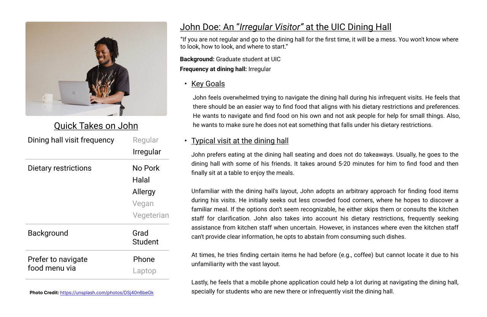

2. **"Regular visitor" (e.g., Jane Doe)**
- Prioritizes quick and efficient location of suitable foods
- Wants to easily avoid specific food types (e.g., spicy foods, pork)
- Needs clear answers about food options without relying on staff knowledge

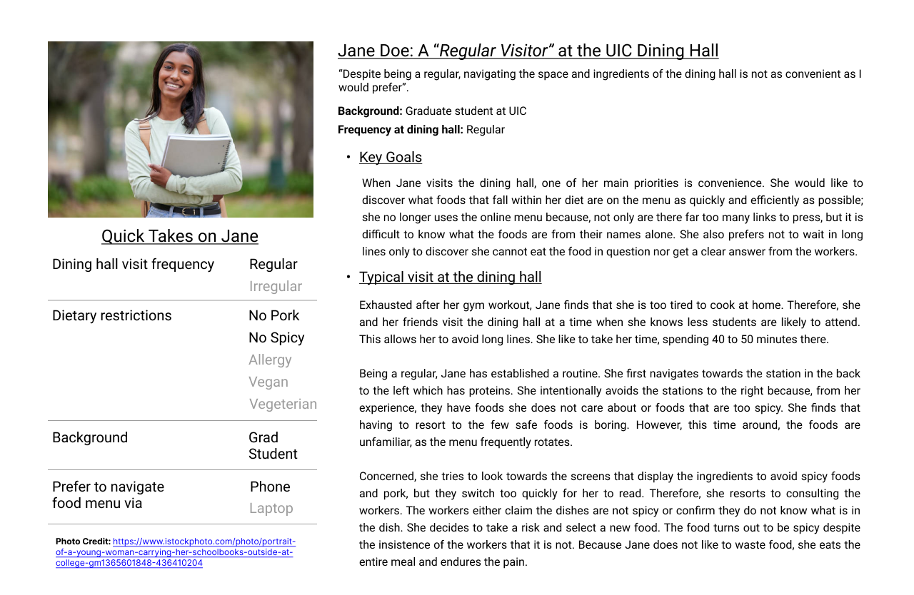

Common needs included:
- Efficient navigation of dining hall menus
- Detailed ingredient and dietary information
- Clear food labels and efficient navigation tools

## Ideation
Our ideation process focused on addressing the needs of both regular and irregular visitors. Key features considered included:

- User profile configuration for dietary restrictions
- Personalized meal planning and recommendations
- Efficient map layout for dining hall navigation
- Detailed ingredient lists for food items

We prioritized designs that directly addressed key user needs and excluded those that introduced unnecessary complexity.

## Low-Fidelity Prototype
Our low-fidelity prototypes included sketches of:
1. A screen for configuring user dietary restrictions
2. A recommended meal plan screen based on user preferences
3. A map layout screen for efficient navigation
4. A screen displaying ingredient lists for selected food items

These sketches formed the basis for our initial design concepts.

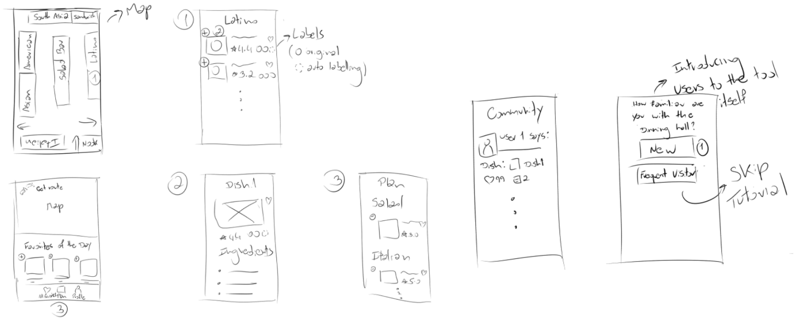

## Figma Prototypes
Based on our low-fidelity prototypes, we created more detailed Figma prototypes. These included:
1. A page for setting dietary restrictions
2. A recommended meal plan page with filtered food options
3. An interactive map of the dining hall with numbered navigation points
4. Detailed food item pages with ingredient lists

The Figma prototypes allowed for a more interactive and visually representative model of our final application.

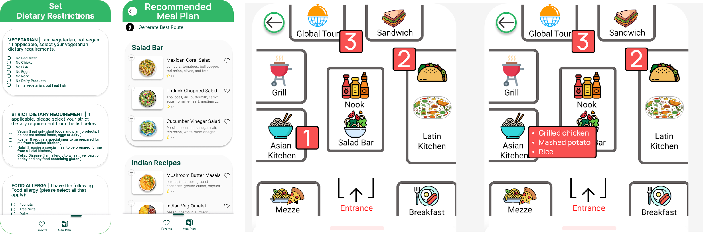

## Implementation
The application was built using:
- React Native and Expo CLI for cross-platform compatibility
- React Components (DishCard.js and PlanCard.js) for reusable UI elements
- React Navigation for seamless navigation between pages
- Local JSON data for quiz questions and options
- React Hooks (useState and useEffect) for efficient state management

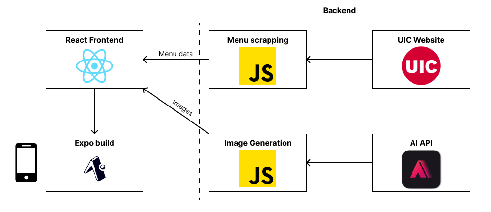

Data flow:
1. Expo CLI initialization
2. Component rendering
3. User interaction triggering state changes
4. Navigation facilitated by React Navigation

Menu data is fetched from a public API exposed by the UIC United Table website. Images were collected manually and supplemented with AI-generated images where necessary.

## Key Features
1. Personalized dietary restriction settings
2. Daily menu recommendations based on user preferences
3. Meal planning functionality
4. Detailed dish information (ingredients, nutritional info)
5. Interactive map for efficient navigation in the dining hall
6. Best route generation for collecting chosen meal items

## Application Components

### Home Screen
- Central hub for navigation to all other screens
- Starting point for setting up dietary restrictions and meal plans

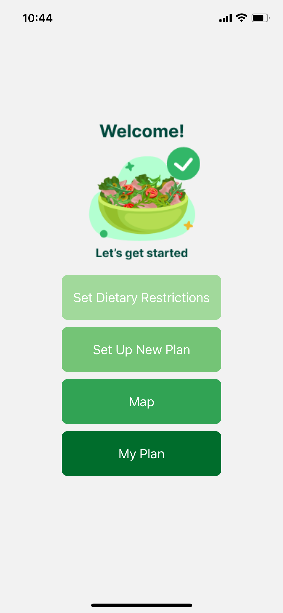

### Set Dietary Restriction Screen
- Users define their dietary preferences and restrictions
- Redirects users back to the Home screen after setup

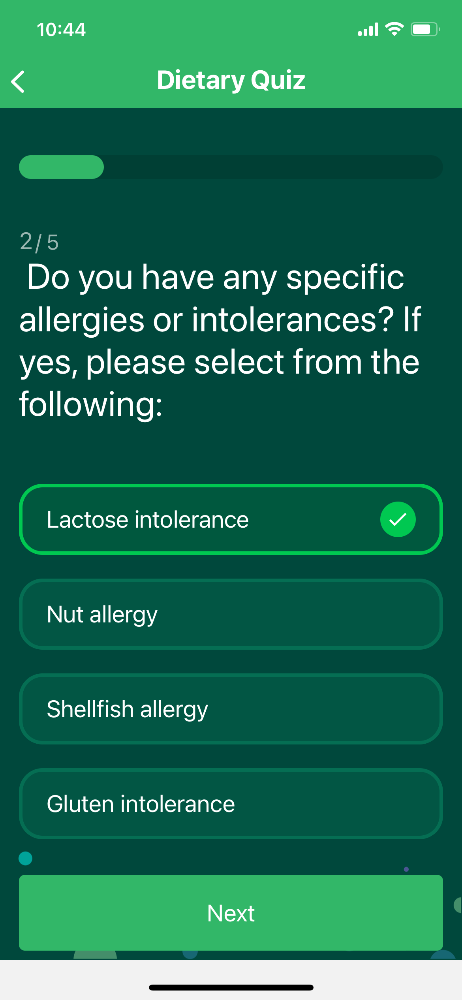

### Set Up New Plan Screen
- Displays recommended food items based on user's dietary preferences
- Allows users to create and save a meal plan for the day
- Access to Dish Details screen for more information on food items

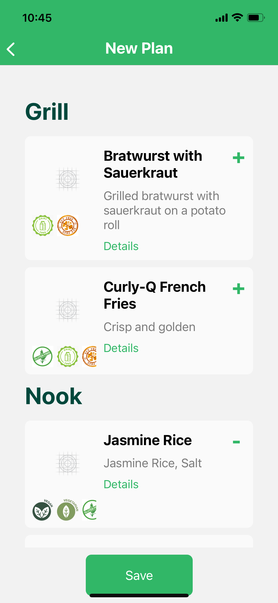

### My Plan Screen
- Displays the user's saved meal plan for the day
- Option to check dish details and navigate to the Map screen

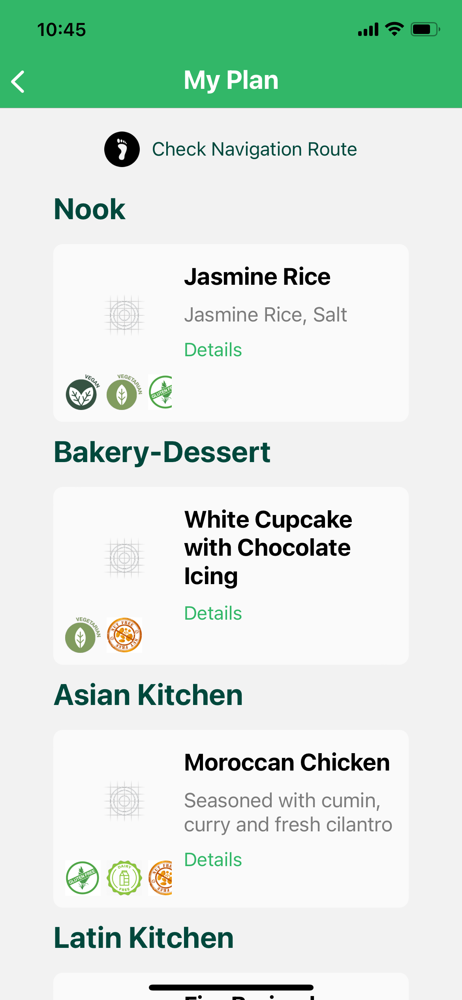

### Dish Details Screen
- Provides detailed information on selected food items
- Includes dish description, ingredient list, and nutrition info

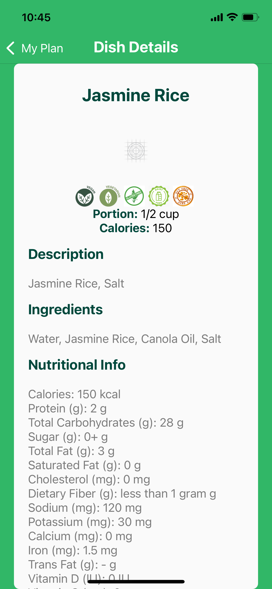

### Map Screen
- Interactive map of the UIC dining hall
- Displays the most efficient route to collect chosen meal items
- Numbered tooltips guide users to specific counters
- Clicking tooltips reveals food items to collect at each counter

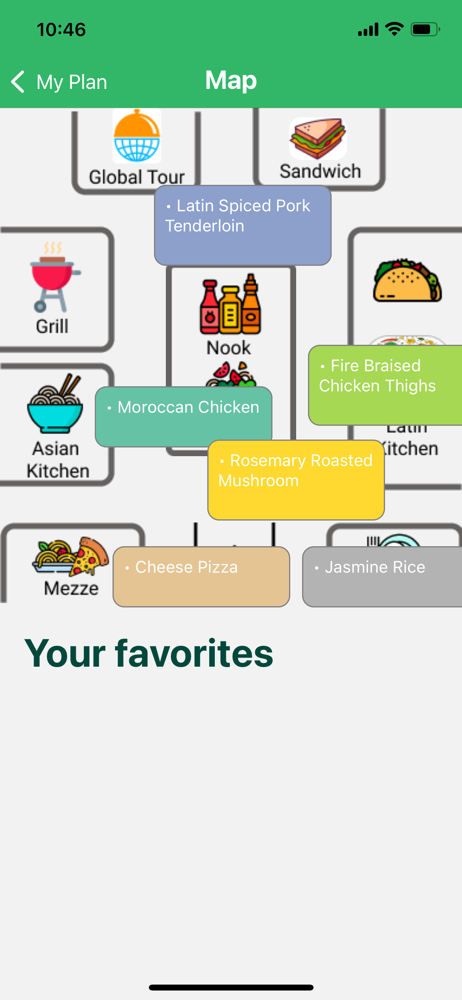

## Evaluation & Analysis
We conducted a comparative study between our app and the existing "Dine on Campus" application. The study involved:
- 6 participants performing tasks in the actual dining hall
- Data collection through user estimates, screen recordings, and qualitative feedback
- Use of Hart and Staveland's NASA Task Load Index (TLX) for task assessment

Key findings:
1. Our app received more positive feedback compared to "Dine on Campus"
2. Users appreciated features like dish photos and easier navigation
3. Statistical analysis showed improvements in perceived efficiency and emotional stability

Areas for improvement:
- Enhancing map tooltips and favorites functionality
- Improving the dietary restrictions quiz
- Addressing minor usability issues

## Future Improvements
- Integration of custom dietary restrictions
- Improved matching of dish images with their physical appearance
- Enhanced quality-of-life interactions and bug fixes

## Conclusion
This project demonstrates the effectiveness of a user-centric design approach in addressing the challenges faced by students with dietary restrictions in university dining halls. The resulting mobile application offers a comprehensive solution for menu exploration, meal planning, and physical navigation within the dining space.
