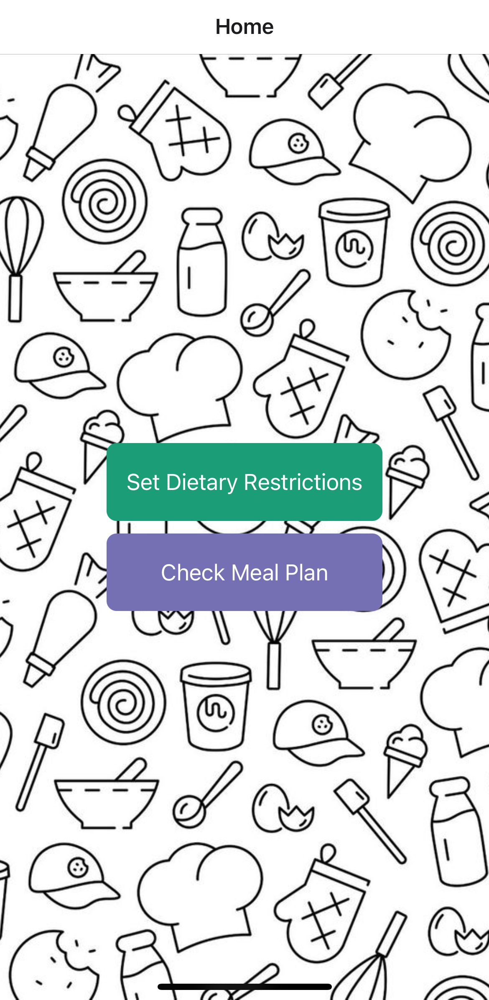

# uic-dining-hall-navigation

## Initial Setup
1. On your terminal run the following commands:
   - `git clone https://github.com/komar41/uic-dining-hall-navigation.git`
   - `cd uic-dining-hall-navigation`
     
2. Install **Node.js** from [https://nodejs.org/en/download](https://nodejs.org/en/download).
<!-- - npm install -g expo-cli -->

3. Download the **Expo Go** app on your phone to test the app on the development server.

<!-- - npm install @react-navigation/native
- npx expo install react-native-screens react-native-safe-area-context
- npm install @react-navigation/native-stack -->

4. On your terminal, run the following commands:
   - `npm install`
   - `npm start`

5. Scan the QR code on your phone to test the app.

## Home Screen

